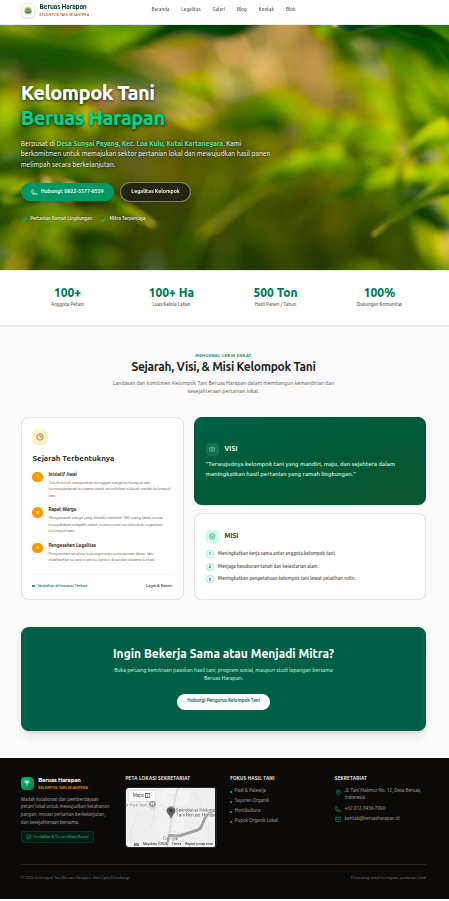
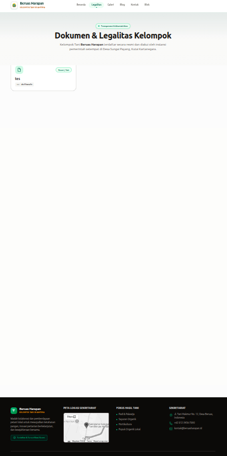
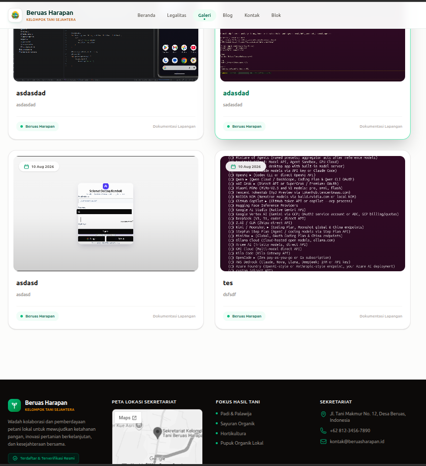
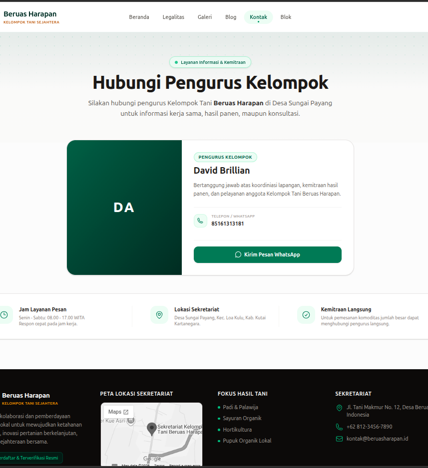
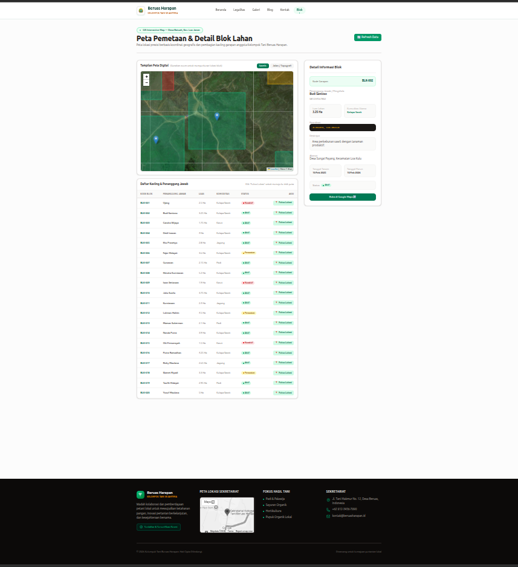
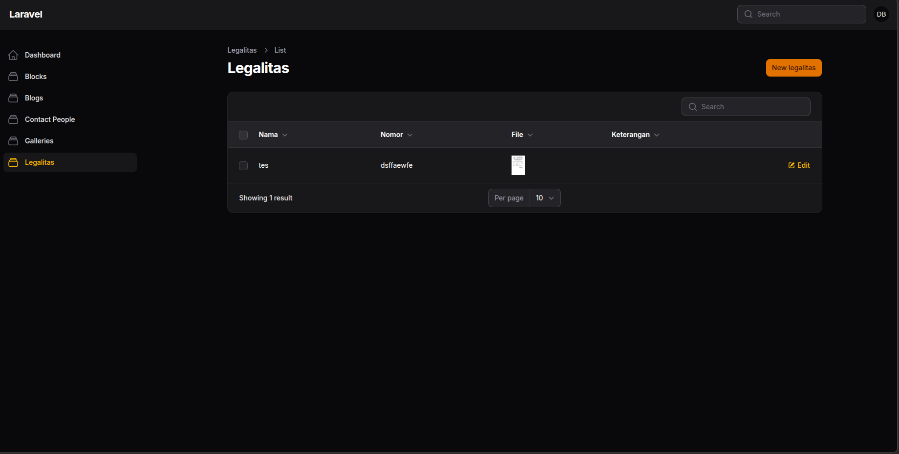
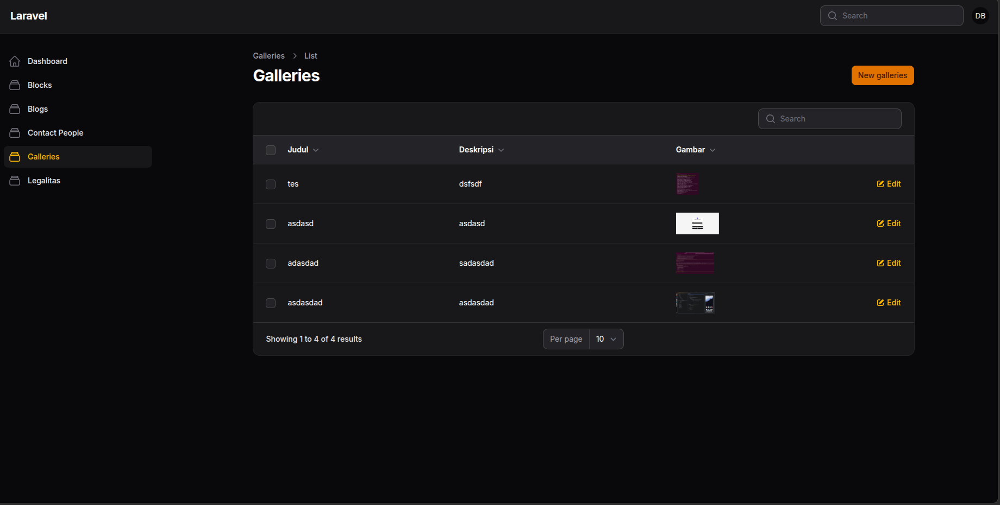
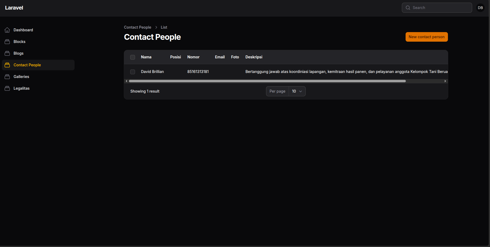
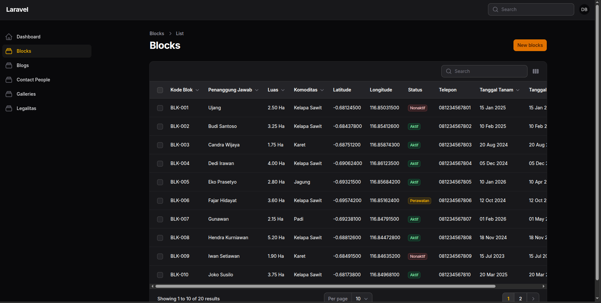

# 📸 Preview & Halaman Aplikasi

Berikut adalah dokumentasi antarmuka dan penjelasan fitur untuk tiap halaman pada platform web **Kelompok Tani Beruas Harapan**, baik untuk tampilan **Frontend (Publik)** maupun **Admin Panel (Management)**:

---

## 🌐 Antarmuka Publik (Frontend)

### 1. Halaman Beranda

**Deskripsi:**
Halaman utama (*landing page*) yang memberikan ringkasan informasi profil Kelompok Tani Beruas Harapan.
* **Hero Section:** Menampilkan profil singkat, lokasi (Desa Sungai Payang, Kec. Loa Kulu, Kutai Kartanegara), tombol *Call-to-Action* (CTA), serta statistik utama (*Quick Stats*) seperti jumlah anggota, luas kelola lahan, dan estimasi hasil panen tahunan.
* **Sejarah, Visi, & Misi:** Menjelaskan alur historis pembentukan kelompok tani, visi pertanian ramah lingkungan, serta misi pengembangan anggota.
* **Seksi Kemitraan:** Mengajak pihak luar/mitra untuk berkolaborasi dalam program sosial, pasokan hasil tani, maupun studi lapangan.
* **Footer Dynamic:** Dilengkapi dengan peta lokasi sekretariat (*embedded Google Maps*), fokus komoditas, dan kontak resmi.

---

### 2. Halaman Legalitas & Dokumen

**Deskripsi:**
Halaman khusus untuk menjaga transparansi dan akuntabilitas organisasi.
* **Dokumen Resmi:** Menampilkan daftar arsip legalitas, surat keputusan (SK), serta surat verifikasi resmi dari instansi pemerintah setempat yang terdaftar dan diakui.

---

### 3. Halaman Galeri Dokumentasi

**Deskripsi:**
Modul galeri untuk menampilkan wujud visual dari berbagai kegiatan dan dokumentasi lapangan.
* **Grid Card Layout:** Menampilkan repositori foto kegiatan, pelatihan, dan aktivitas pertanian lengkap dengan judul, deskripsi singkat, tag kategori, serta tanggal rilis dokumentasi.

---

### 4. Halaman Kontak & Layanan Informasi

**Deskripsi:**
Halaman komunikasi interaktif yang memudahkan anggota maupun pihak eksternal untuk terhubung dengan pengurus.
* **Profil Pengurus:** Menampilkan kartu kontak penanggung jawab lapangan/kemitraan lengkap dengan nomor telepon serta tombol pintas *direct message* ke WhatsApp.
* **Informasi Layanan:** Informasi jam operasional layanan pesan, alur konsultasi, dan lokasi sekretariat.

---

### 5. Halaman Peta Pemetaan & Detail Blok Lahan (GIS / Interactive Map)

**Deskripsi:**
Fitur unggulan berupa Sistem Informasi Geografis (GIS) interaktif untuk memetakan dan mengelola kavling lahan garapan anggota secara presisi.
* **Interactive GIS Map:** Menampilkan polygon pemetaan kavling/blok lahan di atas peta citra satelit/topografi secara real-time.
* **Tabel Informasi Lahan:** Menyajikan data tabular lengkap yang mencakup Kode Blok, Penanggung Jawab/Pengelola, Luas Lahan (Ha), Jenis Komoditas (Kelapa Sawit, Padi, Jagung, dll.), Status Garapan, dan tombol navigasi *Fokus Lokasi*.
* **Sidebar Detail Lahan:** Menampilkan rincian data spasial ketika suatu blok dipilih pada peta, mencakup koordinat presisi, riwayat tanggal tanam/panen, deskripsi lahan, hingga integrasi rute navigasi Google Maps.

---

## 🛠️ Dashboard & Admin Panel

Halaman manajemen internal (*backoffice*) yang digunakan oleh pengurus/admin untuk mengelola konten, data legalitas, galeri, kontak, hingga pemetaan spasial lahan.

### 1. Manajemen Legalitas & Dokumen

**Deskripsi:**
Modul pengarsipan dan publikasi dokumen legalitas.
* Memungkinkan admin untuk mengunggah (*upload*), memperbarui, atau menghapus berkas SK dan dokumen pendukung organisasi secara terstruktur.

---

### 2. Manajemen Galeri Dokumentasi

**Deskripsi:**
Panel pengolahan repositori galeri kegiatan.
* Fitur *Create, Read, Update, Delete* (CRUD) untuk mengunggah foto kegiatan lapangan, memberikan tag/kategori, serta menentukan deskripsi dan tanggal dokumentasi.

---

### 3. Manajemen Kontak & Pengurus

**Deskripsi:**
Panel pengelolaan informasi kontak dan data pengurus.
* Mengatur daftar nama pengurus, jabatan, nomor WhatsApp operasional, serta pengaturan informasi layanan konsultasi.

---

### 4. Manajemen Data Spatial & Blok Lahan (GIS Admin)

**Deskripsi:**
Panel kontrol pemetaan spasial dan basis data kavling lahan.
* Memungkinkan admin menginput koordinat/polygon baru, mengelola data pemilik/pengelola lahan, memperbarui jenis komoditas, status garapan, serta estimasi tanggal tanam dan panen.
